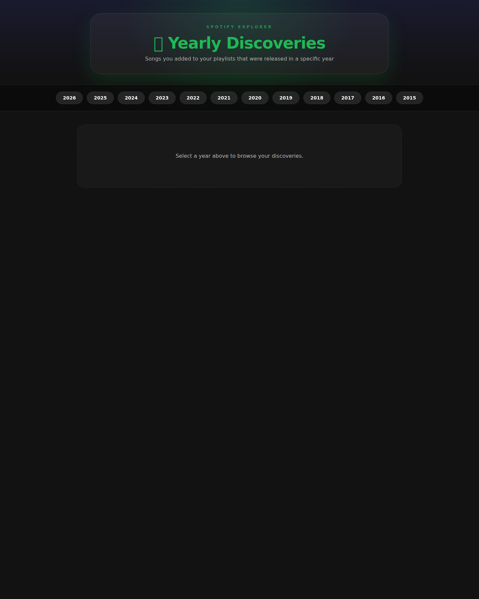
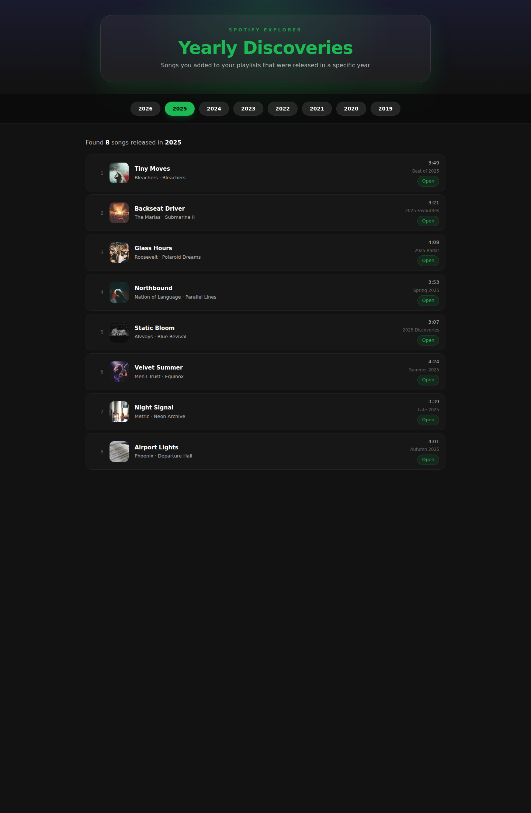

# Spotify Discoveries (per year)

I wanted to know which songs I've discovered in a given year and added to my playlists that are actually _from_ that year. Therefore I made this small program.

## Why?
A lot of "best of 202x" / "top 202x songs" / "best artists 202x" lists contain songs that might have received heavy airplay in 202x but are actually not even from 202x — probably 202x-1 or even earlier. This is totally fine. But for myself I wanted to find out which songs I discovered in a particular year that are _actually_ from that year.

## What it's doing
The program checks all playlists whose name contains the value of `YEAR_TO_CHECK` (e.g. "2025") and looks for songs that are actually released in that year _and_ have been added to your library (❤️ in Spotify). If both conditions are true it adds those songs to the specified target playlist.

Set `ONLY_LOVED_SONGS=false` to also include tracks that are **not** in your library (🤍 in Spotify).

There is also a **web UI** mode (see below) that lets you browse your yearly discoveries interactively without writing anything to a playlist.

Here are my playlists for [2022](https://open.spotify.com/playlist/4AJnjP36kH39gQhgZFL8Ff?si=0f8b2b44f7ca4208), [2021](https://open.spotify.com/playlist/3qDtmE3TrHkjVOow3rM3BY?si=8f212c2c8f0148ee), [2020](https://open.spotify.com/playlist/2D0NidVJbZfnR4wmvYSRiA?si=tVTpL61pRGWypiROYqdeqQ), [2019](https://open.spotify.com/playlist/0uwZfzhqw2G5id1El0oCJE?si=WFk_PEYZSpijQ4gdnYOsXQ).

## How to use it
- Create a [Spotify application](https://developer.spotify.com/dashboard/applications) to receive a client ID and secret
- Create a new (empty) playlist for the songs to be stored in
- Have [Go](https://go.dev/) 1.21+ ready on your machine **or** use the provided [Docker](#docker) image
- Adapt values in the `env` file and copy or rename it to `.env`

## Environment variables

```
SPOTIFY_ID=        # Spotify client ID — register your app at https://developer.spotify.com/
SPOTIFY_SECRET=    # Spotify client secret
PLAYLIST_ID=       # target playlist ID, e.g. 4AJnjP36kH39gQhgZFL8Ff
TOKEN_FILE=mytoken.txt
LOG_FILE=log.txt
ONLY_LOVED_SONGS=true  # set to false to include tracks not saved to your library
YEAR_TO_CHECK=2025
```

## Run it (CLI / batch mode)

1. Generate and store the OAuth token
    ```
    make token
    ```

2. Run the program — it will populate your target playlist
    ```
    make run
    ```

3. Open your playlist 🕺
    ```
    make open-browser
    ```
    If this command doesn't work, open the playlist manually in the browser or Spotify client.

## Web UI

Launch an interactive web UI that lets you browse discoveries for any year without modifying any playlist:

```
make serve
```

The server starts on `http://localhost:8080` by default. You can also pass a custom port:

```
go run ./cmd/spotify-yearly-discoveries -web -port 9090
```

### Screenshots





## Docker

A `Dockerfile` is included for running the batch mode in a container:

```bash
docker build -t spotify-yearly-discoveries .

docker run --rm \
  --env-file .env \
  -v "$(pwd)/mytoken.txt:/app/mytoken.txt" \
  spotify-yearly-discoveries
```

Make sure your `.env` file and token file are present before running the container.

## Contribute
Feel free to open a PR or issue.

I'm happy to hear your feedback via [@jetzlstorfer](https://twitter.com/jetzlstorfer).